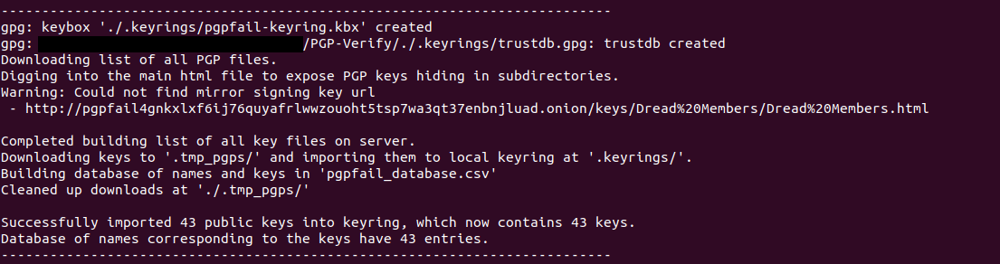
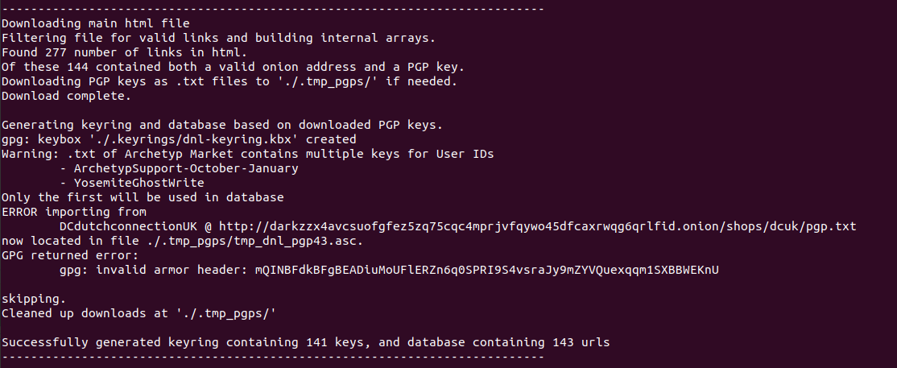
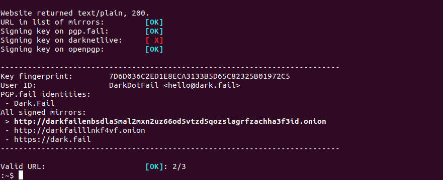

# PGP-Verify

An anti-phishing anti-scamming tool for command-line users. Verifies that the url you want to visit is PGP-signed
with a signature that is listed by key-authorities such as PGP.fail and darknetlive.

## Why PGP-Verify your url?

As noted in the DNM Bible, for good op-sec you should always verify the url that you are visiting is not a phishing
site. A phishing site is a website that looks exactly the same as the one you were expecting, but is controlled by a malicious
entity. The malicious actor could then simply steal your password or other authentication information as you type
it in, and then use this on the real version of the site to e.g. withdraw your account.

In the DNM Bible they propose a simple algorithm for verifying that you are on the real site:

1. Go to the url you want to visit and download its signed mirrors file.
2. If you don't have the key for the site yet, download the PGP file found on the server and import the key into your keyring.
3. Verify that the mirrors file is signed with the key you just imported.

This algorithm is simple and effective if you trust that the key imported from the PGP file is correct. However,
if a threat actor should put their own key in the PGP file, and you don't have access to the old key so you have to
go through step 2., then this algorithm fails.

To address this problem, the following algorithm, which is presented in a guide by *'dark.direct'*, was proposed

1. Go to the url you want to visit and download its signed mirrors file.
2. Go to a **key authority (KA)** and download the PGP file with the key corresponding to the site you want to visit.
3. Check that the signature on the mirrors file was produced by the key downloaded from the KA.
4. Check that the url you want to visit is contained in the mirrors file.

With PGP-Verify, this procedure is automated. It also includes the step of verifying the signature with multiple KAs such
that a malicious actor would have to compromise the site you are visiting, and all KAs checked, in order to fake the signature
of the phishing site.

## Installation

#### Dependencies

You have to have Tor already installed such that *curl* can use the *SOCKS5*
proxy at `localhost:9050`.  If you don't have Tor installed it can be installed
with your favourite package manager e.g. by running
```
sudo apt install torbrowser-launcher
```
on Debian-based systems such as Ubuntu.

PGP-Verify also uses `gpg` in order to verify the PGP signed files. If you don't
have this installed, please run e.g.
```
sudo apt install gpg
```

#### Download instructions

To download this repository you can click the *"Code"* button in the upper right
corner and click *"Download ZIP"*, or, if you have `git` installed, you can simply
download it with
```
git clone https://github.com/tiniPalace/PGP-Verify
```

If you downloaded the *zip*-file, then go to your download directory and unzip it, e.g. with
`unzip PGP-Verify-main.zip`,
which will create an `PGP-Verify-main` directory in your download folder.

#### Install to command line

You might want to be able to run `verify-mirror` on the command line at any time, without having to navigate to the
download folder and running the scripts with `./verify-mirror.sh`. To do this, simply run the script
```
<download directory>/install-bashrc.sh
```

This will add a function `verify-mirror` to your `.bashrc` file which will make you able to run the command at any time.


If you are
not able to run the scripts, you might need to change premissions to make them executable
by running
```
chmod 774 *.sh
```


## Usage

If the site does not have any captcha barriers and has a mirrors files available, then after download
go to the folder with the `.sh` files and run
```
./verify-mirror.sh <url to mirror file>
```

On first use, PGP-Verify will ask to contact the key authorities in order to obatin trusted keys. Answer
`'y'` when prompted to do this as shown in the figure below.






Upon completion, PGP-Verify will print information on the key
and whether the mirror could be verified by the key-authorities. If you get an `[OK]` in the end, then
the url can be trusted.

In the example below we asked to verify the mirror located at `http://darkfailenbsdla5mal2mxn2uz66od5vtzd5qozslagrfzachha3f3id.onion/mirrors.txt`



As shown in the image, PGP-Verify makes a mirror url bold with a `>` to the left, if it matches the
domain of the url we inserted initially.

In the case that the mirrors file is hidden behind a captcha barrier or other DDOS protection, then you
will have to download the mirrors file manually e.g. by copy-pasting it into your favourite text editor
and saving it somewhere on your machine. Then navigate to the PGP-Verify folder and run
```
./verify-mirror.sh -i <path to locally downloaded mirrors file> <url to site you want to go to>
```

Other options are enumerated below and can be included through the syntax
```
./verify-mirror.sh [options] <url>
```

## How does it work?

First you run
```
./update-dnl-keyring.sh
```
This downloads all the PGP-files from darknetlive and puts it in a custom gpg keyring on your machine located in the
`.keyrings/` folder in the folder you ran the script in. It also generates a `.csv` file with all the onion addresses
with their corresponding keys.

You then run
```
./update-PGPfail-keyring.sh
```
which does more or less exactly the same thing, except for PGP.fail instead of darknetlive.

When you now run either
```
./verify-mirror.sh <url to file with signed mirrors>
```
or
```
./verify-mirror.sh -i <path to mirrors file> <url you want to visit>
```
PGP-Verify figures out which key the list of mirror urls was signed with. It then checks each of the key-authority
keyrings that were generated previously and sees if the key is in the keyring. If it is, it then uses this key to
check the signature of the list of mirrors. PGP-Verify does this for every key-authority that it knows of. It also
checks that the url you inserted actually matches one found in the signed list of mirrors.

## Options

- `-i, --input <file path>`
Specify PGP-signed mirrors file."
- `-k, --keep-temporary-files`
Don't delete mirrors file and keyserver output after completion."
- `--keyserver-time-limit <seconds>`
How long to wait until aborting trying to connect to keyserver"
- `-p,--port <port number>`
Specify a non-default port (default is 9050) for the Tor Socks5h proxy on localhost."
- `-s,--silent`
Only print validation message."
- `-t,--time-limit <seconds>`
How many seconds to wait for a HTTP GET request using curl."
- `-w,--wipe`
Remove all downloaded and produced files such as keyrings, mirrors file, etc. Leaving only files essential for operation."

